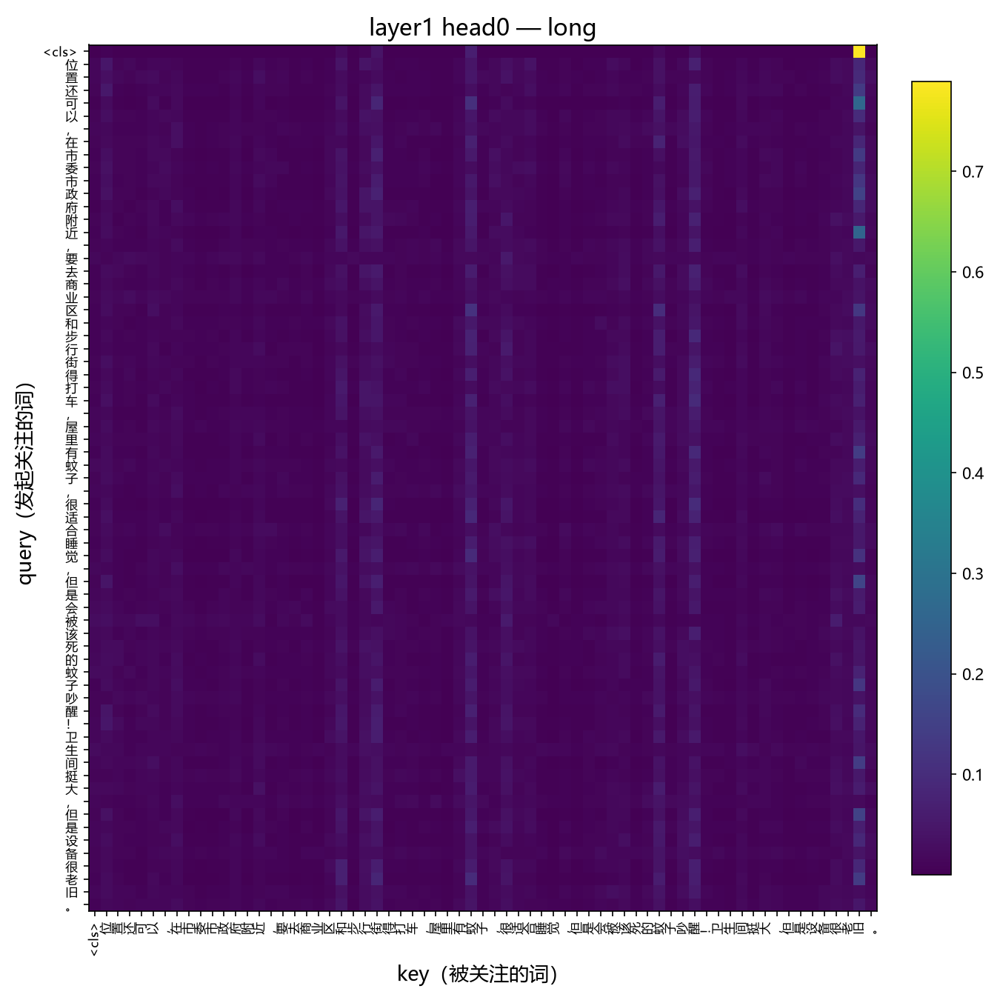
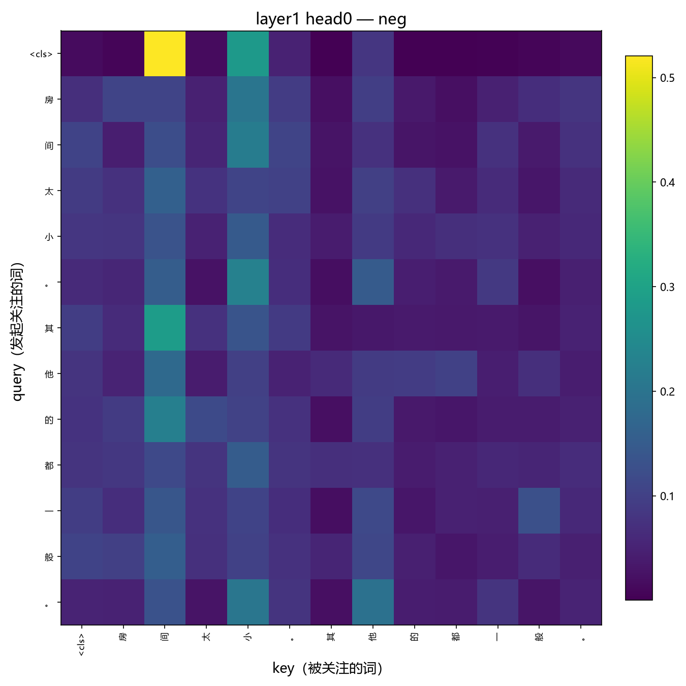
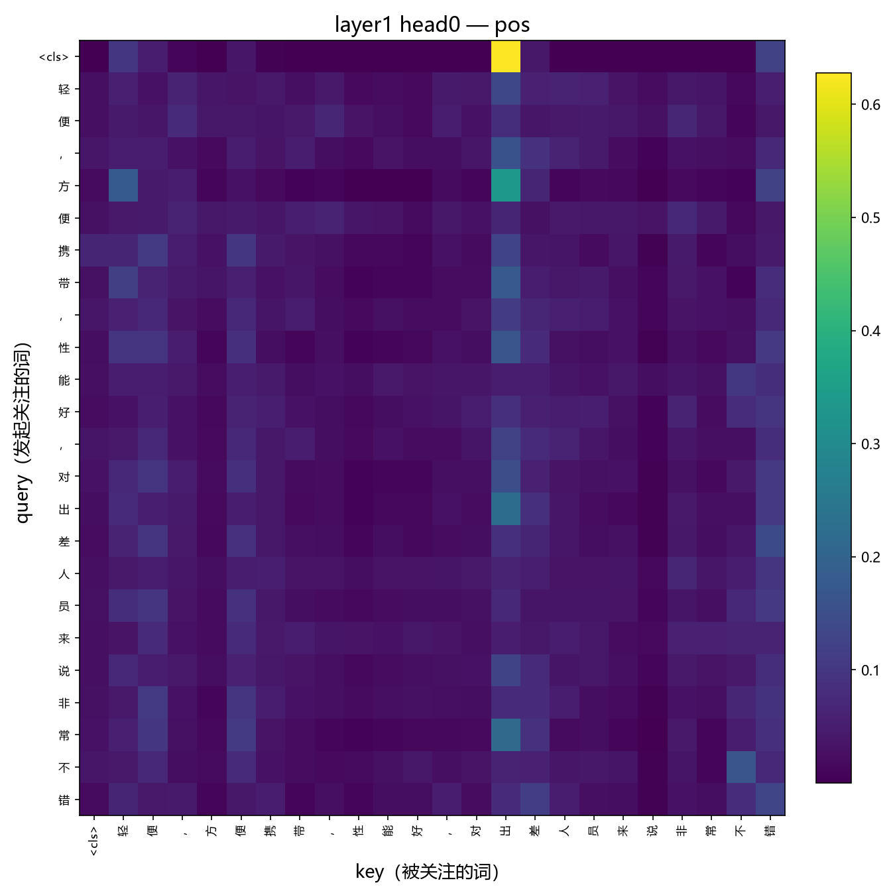
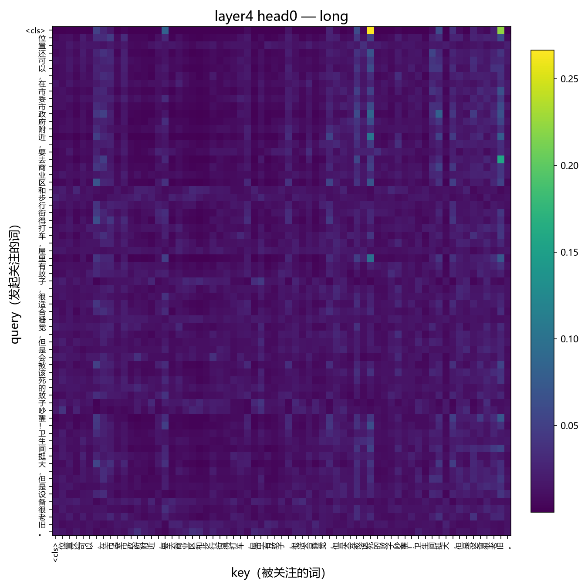
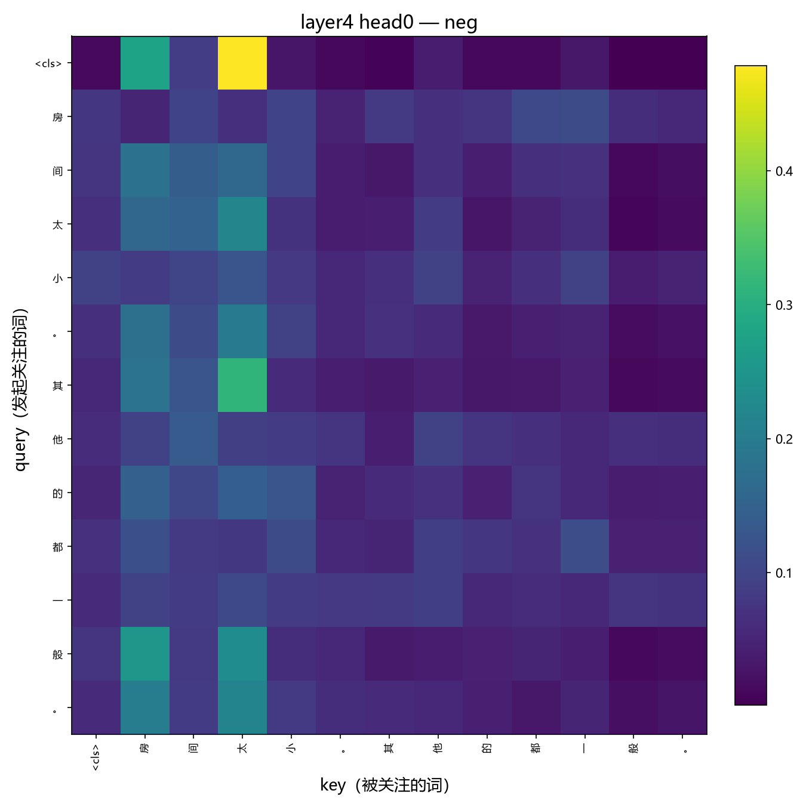
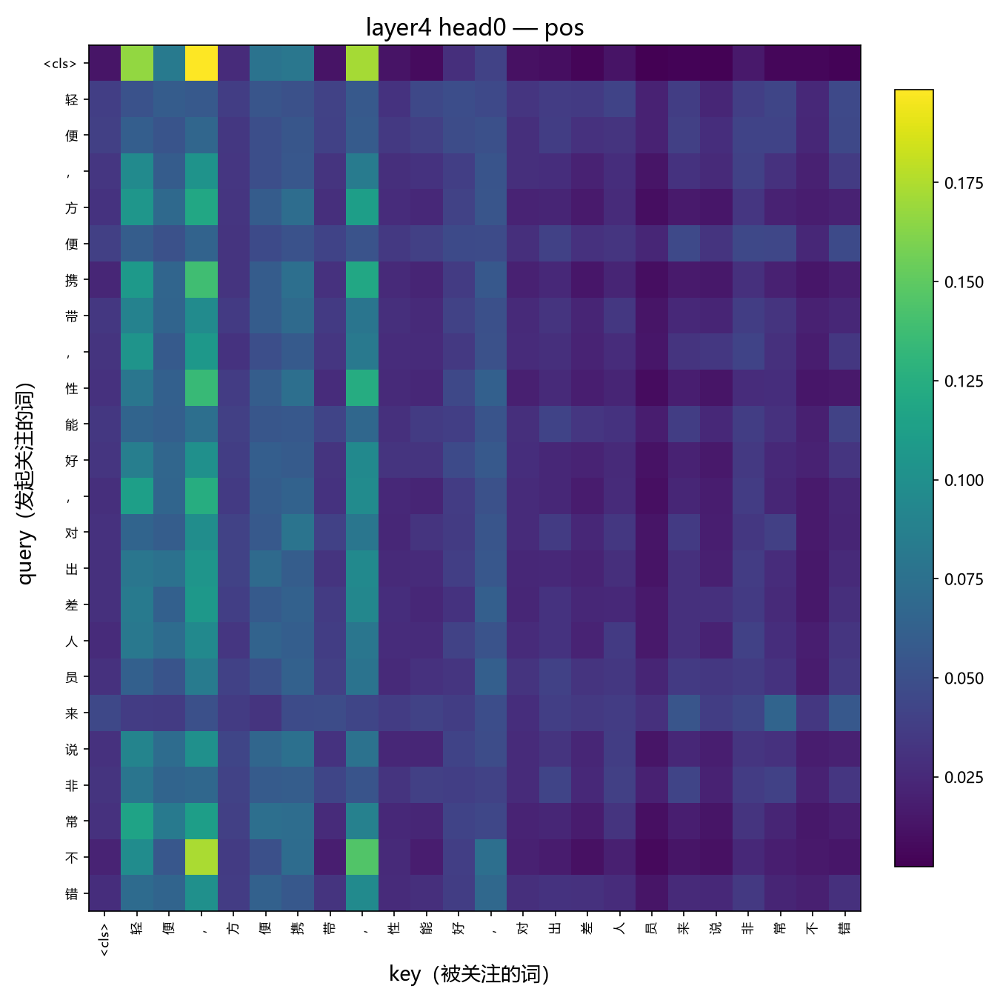

**Fork 仓库**：https://github.com/SHrink1122/llm-beginner

**DoD Checklist**

- [x]  M1 手写 scaled_dot_product_attention，attention_correctness 通过（max_abs_diff 9.5e-07 < 1e-5）
- [x]  M2 MultiHeadAttention + TransformerBlock，前向形状正确
- [x]  M3 ChnSentiCorp dev 准确率 0.8558 ≥ 0.80
- [x]  M4 causal mask 通过（leaked_diff = 0.0）
- [x]  M5 输出 3 张注意力热图
加分（任选）：
- [x]  **S3** dev 准确率 > 0.88（强结果）

**eval/result.json**  
{  
"attention_correctness": {"pass": true, "max_abs_diff": 7.152557373046875e-07},  
"causal_mask": {"pass": true, "leaked_diff": 0.0},  
"classifier_accuracy": {"pass": true, "accuracy": 0.9083, "baseline_reference": 0.85}  
}
## 参数设置

char-level tokenizer（vocab **4253** = 4250 个字符 + `<pad>/<unk>/<cls>` 3 个特殊 token），d_model=256、6 层 8 头、d_ff=1024、dropout=0.1，AdamW（lr=3e-4）+ warmup（10%）+ cosine 学习率调度，batch=64，最大长度 256，训练 10 个 epoch，按 dev acc 保存最优 checkpoint。

**调参过程**：初始参数设置d_model=128, n_heads=4, n_layers=4, lr=3e-4, batch=32, epochs=5，发现训练初期振荡严重，加入warmup；由于训练集30%的数据seq_len超过128，把max_len调至256，并增加encoder层数，loss明显降低。

## 训练结果

最好 dev_acc = **0.9083**；attention 自检与官方实现误差 **7.15e-07**（<1e-5），causal mask 无未来词元泄漏（leaked_diff = **0.0**）。

## 实验现象

### 注意力热图 

### 实验观察

模型注意力分布整体呈稀疏化特征，且该稀疏趋势随输入文本长度的增加而进一步加剧。层间对比分析显示，不同 Encoder 层所捕获的特征存在显著差异，高层网络的注意力权重呈现逐层递增的规律。进一步对高权重 token 进行语义归类，可将其划分为三类典型模式：功能词（如介词、连词"都""其""太"等）、语料高频词以及标点符号。值得注意的是，受限于字符级分词机制，中文单字缺乏明确的语义边界，导致难以直接验证模型是否基于语义内容执行关注。此外，注意力矩阵对角线区域同样呈现稀疏分布，表明模型对当前位置 token 的自注意力相对较弱。

## 小结

完成全部核心任务及加分项，dev 准确率 0.9083。实现手写注意力与因果掩码，误差达标。调参通过增大模型与长度、加入 warmup 提升效果。注意力热图显示分布稀疏、随长度加剧，高层权重递增，但字符级分词下难以直接验证语义对齐。